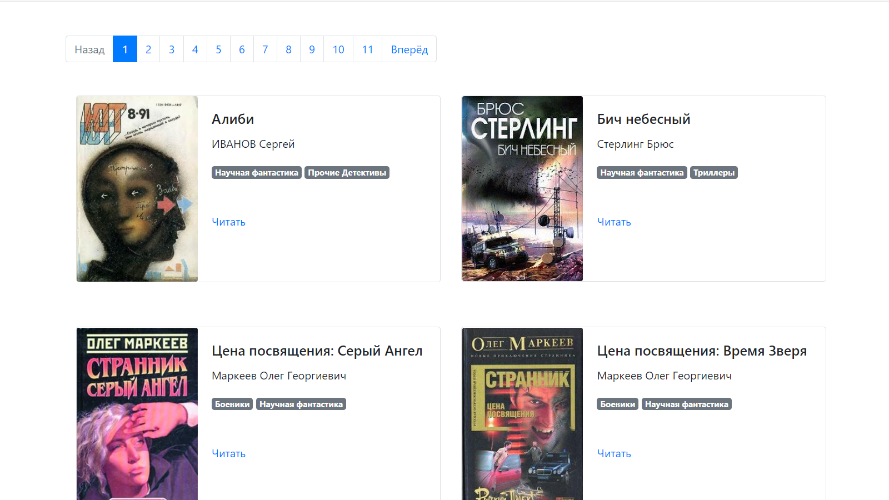

# Онлайн-библиотека

Онлайн-библиотека книг научной фантастики с сайта  [tululu.org](http://tululu.org/), доступна по [ссылке](https://alex-mint.github.io/On-line-library/pages/index1.html)




### Как установить

- Python3 должен быть уже установлен.
- Склонируйте репозиторий на свой компьютер.
```commandline
git clone https://github.com/Alex-mint/On-line-library.git
```  
- Установите зависимости:
```commandline
pip install -r requirements.txt
```

### Запуск

Для запуска программы необходимо написать в терминале следующее:
```commandline
python3 render_website.py
```

Перейти по ссылке: http://127.0.0.1:5500
